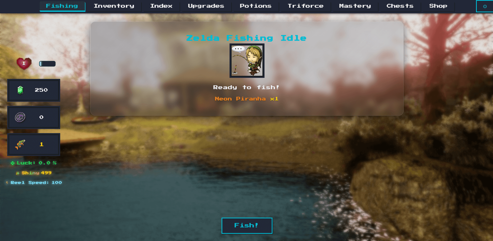

# Zelda Fishing Idle 🎣🐟

A browser-based Legend of Zelda inspired fishing idle game.  
**Play Here:** [https://edwinyaboy.github.io/zeldafishingidle/](https://edwinyaboy.github.io/zeldafishingidle/)

⚠️ **Still in development — expect bugs!** Please report issues or suggestions.

---

## Update List

- [ ] Mobile Compatibility [95% Complete, Add Rupee/Mon Counter to Fishing Page, Fix Some Text Placement]
- [ ] Fish Weight System
- [ ] Mobile APK
- [X] Standalone Executable
- [X] Achievements System
- [X] Currency & Items Update
- [X] Triforce & Special Items
- [X] Fishing Mechanics (Bye bye autoclicking! 😢)
- [X] Lures & Consumables
- [X] Upgrades & Stats
- [X] Inventory, Shop & Index

**And much more!**

---

### Screenshots

---
